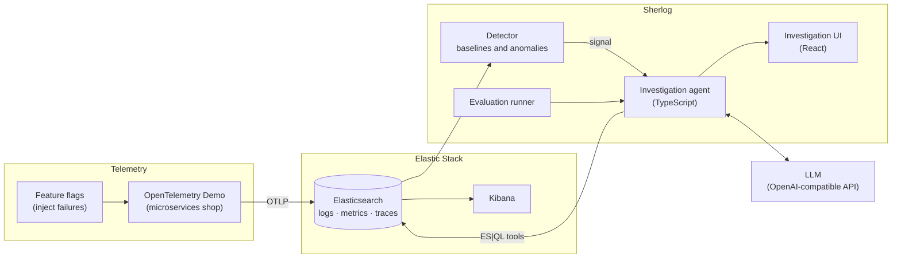

# Sherlog: a mini AI SRE

An AI agent that investigates production incidents the way an on-call engineer would. It reads logs, metrics and traces from Elasticsearch, follows the evidence step by step and proposes a root cause. Every conclusion comes with the queries and data that support it, so a human can check it, question it and decide what to do.

> **Status: work in progress.** This is a learning project. The roadmap at the end shows what is done and what is next.

## Why I'm building it

When an alert fires, the hard part is not knowing that something broke. It's finding out **why**, and that usually means jumping between dashboards, logs and traces until the pieces fit. I wanted to see how far an agent can get doing that work on its own, and, more importantly, how to show its reasoning so an engineer can **trust it or prove it wrong** in a few seconds.

Three ideas guide the project:

1. **No evidence, no conclusion.** The agent can only claim something if it can point to the query and the data behind it.
2. **The reasoning is the product.** The interface shows every step the agent took, not only the final answer.
3. **If you can't measure it, you can't improve it.** Every change to the prompts, tools or model is tested against a set of real incidents with a known cause.

## How it works



1. **Telemetry.** The [OpenTelemetry Demo](https://github.com/open-telemetry/opentelemetry-demo), a small online shop made of microservices, runs locally and sends its logs, metrics and traces to Elasticsearch.
2. **Detection.** A detector learns what normal looks like for each service (error rate, latency, throughput) and raises a **signal** when something changes in a meaningful way.
3. **Investigation.** The agent receives the signal and starts a loop: decide what to check next, run a query, read the result, update its hypotheses. It stops when it has enough evidence to conclude, or when it reaches its step limit and says it doesn't know.
4. **Explanation.** The UI shows the investigation as a timeline: every question the agent asked, the query it ran, what it found and why it moved on. The final answer links back to the evidence.
5. **Evaluation.** The same incidents are replayed after every change, and the results are compared with the known root cause.

## The agent

The agent is a tool-using loop written in TypeScript. It never touches Elasticsearch directly. It can only use a small set of tools, each one a typed function with a clear purpose:

| Tool | What it does |
|---|---|
| `list_services` | Lists the services that reported data in a time window. |
| `error_rate` | Error rate of a service, compared with its baseline. |
| `latency_percentiles` | p50, p95 and p99 latency of a service or endpoint. |
| `search_logs` | Finds log lines by service, level and text, grouped by message pattern. |
| `trace_breakdown` | Follows slow or failed traces and shows where the time or the error comes from. |
| `dependencies` | Which services call which, built from the traces. |
| `recent_changes` | Feature flags and deployments that changed in the window. |

Each tool runs an **ES|QL** query and returns a short, structured summary instead of raw documents. This keeps the context small, makes the cost predictable and lets the UI show the exact query behind each step.

**Context management.** The agent keeps a running list of hypotheses and the evidence for and against each one. Old tool results are summarised instead of resent, so long investigations don't fill the context window.

**Guardrails.** A step limit, a token budget per investigation, and a rule that the final answer must cite at least one piece of evidence. If it can't, the honest answer is "not enough evidence", and that is a valid result.

## The interface

A React app with three views:

- **Signals:** what the detector found, with the chart that triggered it.
- **Investigation:** the timeline of the agent's steps. Each step can be opened to see the query, the raw result and the agent's reasoning at that moment.
- **Conclusion:** the proposed root cause, the evidence that supports it, what was ruled out and a suggested next action. The engineer can mark it as correct or wrong, and that feedback is saved for the evaluation set.

## Evaluation

The OpenTelemetry Demo includes feature flags that break things on purpose, for example a failing payment service, a slow image loader, a CPU spike in the ad service or a memory leak in a cache. That gives me incidents with a **known root cause**.

The evaluation runner:

1. Turns on a flag, waits for the signal and lets the agent investigate.
2. Compares the agent's answer with the expected cause.
3. Saves everything: steps, queries, tokens, time and final answer.

| Metric | Question it answers |
|---|---|
| Root cause accuracy | Did it find the right service and the right cause? |
| Evidence quality | Do the cited queries actually support the conclusion? |
| Honest "I don't know" | When the cause is unclear, does it say so instead of guessing? |
| Steps and time | How long does it take to get there? |
| Cost | How many tokens per investigation? |

Because LLMs are non-deterministic, every incident runs several times and the results show the average and the spread, not a single lucky run. A change to a prompt or a tool only stays if it doesn't make the numbers worse.

## Free by design

The whole project runs at zero cost. Every piece is open source or has a free tier:

| Part | Free option |
|---|---|
| Telemetry | OpenTelemetry and the OpenTelemetry Demo |
| Storage and search | Elasticsearch and Kibana, self-hosted in Docker (the free tier includes ES\|QL) |
| Agent, UI and evaluation | Node.js, TypeScript and React |
| LLM | Groq free tier or Ollama, see below |
| Hosting | A laptop with 16 GB of RAM, using the light version of the demo and Elasticsearch capped at 2 GB |

## Choosing the LLM

The agent talks to any **OpenAI-compatible API**, so the model is a setting, not a dependency. Changing it is two lines in `.env`:

```bash
# Groq, free tier
LLM_BASE_URL=https://api.groq.com/openai/v1
LLM_MODEL=llama-3.3-70b-versatile

# Ollama, running locally
LLM_BASE_URL=http://localhost:11434/v1
LLM_MODEL=qwen2.5:7b
```

| | Groq (free tier) | Ollama (local) |
|---|---|---|
| Models | Large open models, like Llama 3.3 70B | Small models that fit on a laptop, 7B to 8B |
| Speed | Very fast | Depends on the machine |
| Limits | Requests and tokens per minute and per day | None |
| Data | Sent to Groq's API | Never leaves the machine |
| Best for | Development, demos and most evaluation runs | Private data and backup when Groq limits are reached |

**Living with rate limits.** An investigation sends its growing context on every step, so the token-per-minute limit is the first one to hit. The agent is built for that: tools return short summaries instead of raw documents, old steps are summarised instead of resent, evaluation incidents run one after another, and a request that gets a rate limit response (HTTP 429) waits and retries.

**Private data.** For any platform with real user or business data, the default is a local model with Ollama, so nothing leaves the machine.

**Comparing models is part of the evaluation.** The same incidents run against both setups, so the results table answers a practical question: how close does a small free local model get to a large hosted one, and what does each cost in time and tokens?

## Tech stack

| Layer | Technology |
|---|---|
| Telemetry | OpenTelemetry Demo, OTLP |
| Storage and search | Elasticsearch, ES\|QL, Kibana |
| Agent | Node.js, TypeScript, an OpenAI-compatible LLM API (Groq or Ollama) |
| Interface | React, TypeScript |
| Evaluation | TypeScript runner, results saved as JSON and shown in the UI |
| Infrastructure | Docker Compose |

## Project structure

```text
.
├── agent/            # investigation loop, tools and prompts
│   ├── tools/        # one file per tool, each with its ES|QL query
│   └── prompts/
├── detector/         # baselines and signal generation
├── ui/               # React app: signals, investigation timeline, conclusion
├── evals/
│   ├── incidents/    # one file per incident: flag, expected cause, notes
│   └── results/      # saved runs
└── docker-compose.yml  # Elasticsearch, Kibana, OpenTelemetry Demo, Sherlog
```

## Running it locally

You need Docker, Node.js 22 and either a free Groq API key or Ollama installed.

```bash
cp .env.example .env      # choose Groq or Ollama, see "Choosing the LLM"
docker compose up -d      # Elasticsearch, Kibana and the OpenTelemetry Demo
npm install
npm run dev               # agent API and UI
```

Then open the UI, turn on one of the demo's feature flags and watch the investigation start.

## Roadmap

- [ ] **1. Telemetry:** OpenTelemetry Demo sending logs, metrics and traces to a local Elasticsearch and Kibana.
- [ ] **2. Tools:** the ES|QL tools, tested one by one against real demo data.
- [ ] **3. Agent loop:** hypotheses, tool calls, stop condition and evidence-backed answers.
- [ ] **4. Investigation UI:** timeline, step details and conclusion view.
- [ ] **5. Evaluation:** 15 to 20 incidents with known causes, repeated runs and a results table in this README.
- [ ] **6. Detector:** baselines per service and automatic signals, so investigations start without a human.
- [ ] **7. Multi-agent:** separate agents for logs, metrics and traces coordinated by a lead agent, compared against the single agent in the evaluation.

## What I'm learning

This project is my way of going deeper into agent systems: tool use, context management, deciding when an agent has enough evidence, and evaluating something that doesn't give the same answer twice. I'll keep notes on what worked and what didn't as the project grows.

## License

MIT
